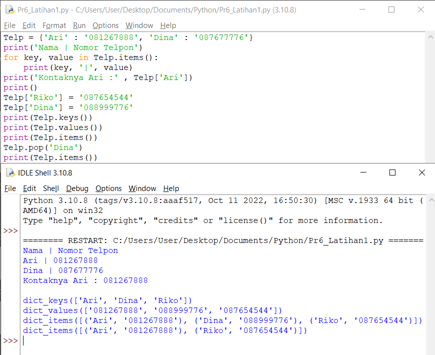
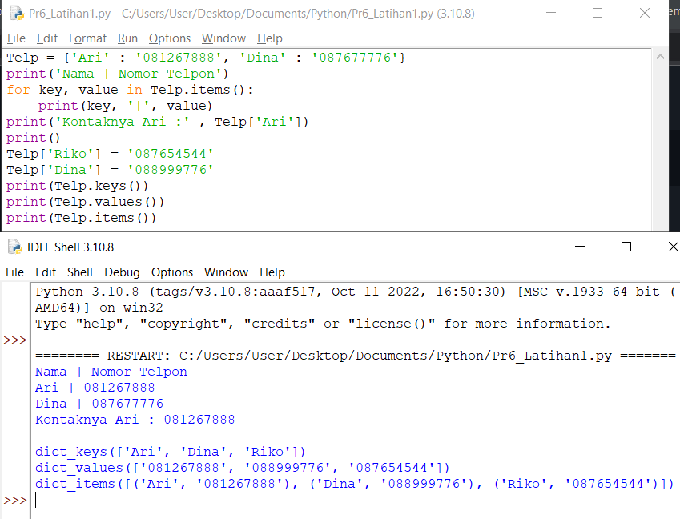

# Praktikum 6
## Latihan 1 
- Buat Dictionary daftar kontak 
- Nama sebagai key, dan nomor sebagai value
- Tampilkan kontaknya Ari
- Tambah kontak baru dengan nama Riko, nomor 087654544
- Ubah kontak Dina dengan nomor baru 088999776
- Tampilkan semua Nama
- Tampilkan semua Nomor

- Tampilkan daftar Nama dan nomornya
- Hapus kontak Dina

