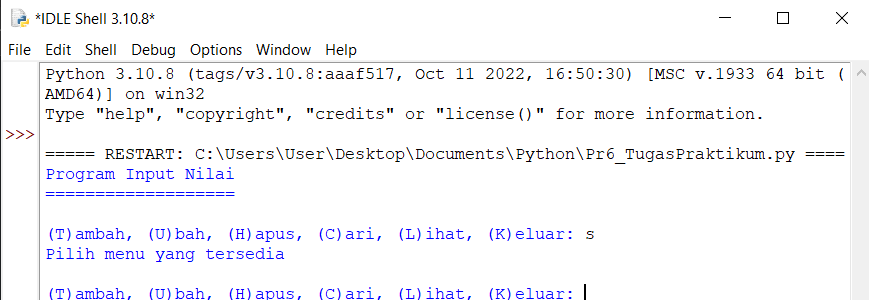
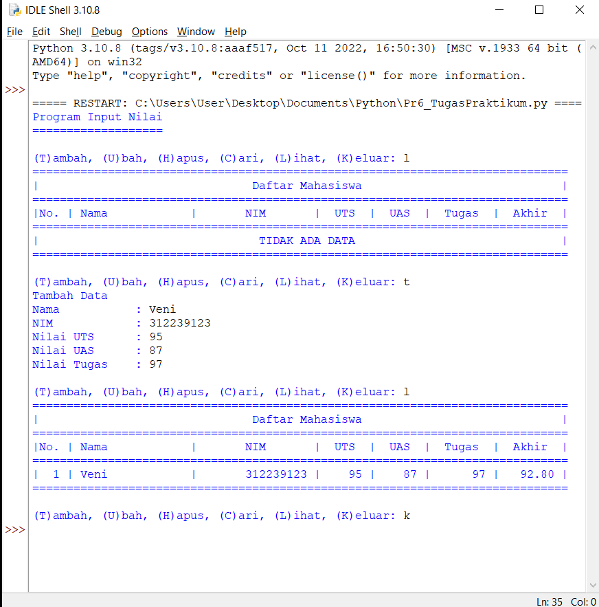

# Praktikum 6
## Latihan 1 
- Buat Dictionary daftar kontak 
- Nama sebagai key, dan nomor sebagai value
- Tampilkan kontaknya Ari
- Tambah kontak baru dengan nama Riko, nomor 087654544
- Ubah kontak Dina dengan nomor baru 088999776
- Tampilkan semua Nama
- Tampilkan semua Nomor

- Tampilkan daftar Nama dan nomornya
- Hapus kontak Dina

## Tugas Praktikum
### Buat program sederhana yang akan menampilkan daftar nilai mahasiswa
- Pertama, kita bikin *Dictionary* terlebih dahulu 
```
data = {}
```
- Kemudian kita membuat kondisi perulangan yang digunakan untuk pilihan menu yang akan menjalankan program 
```
While True:
   v = input("\n(T)ambah, (U)bah, (H)apus, (C)ari, (L)ihat, (K)eluar: ")
```
- Setelah itu kita membuat statement pertama, yaitu program untuk menambahkan data```(T)ambah```
```
    if v.lower() == 't':
        print("Tambah Data")
        nama = input("Nama           : ")
        nim = int(input("NIM            : "))
        uts = int(input("Nilai UTS      : "))
        uas = int(input("Nilai UAS      : "))
        tugas = int(input("Nilai Tugas    : "))
        akhir = tugas*30/100 + uts*35/100 + uas*35/100
        data[nama] = nim, uts, uas, tugas, akhir
```
- Lalu kita membuat statement kedua, yaitu program untuk mengubah data```(U)bah```
```
    elif v.lower() == 'u':
        print("Ubah Data")
        nama = input("Masukkan Nama  : ")
        if nama in data.keys():
            nim = int(input("NIM            : "))
            uts = int(input("Nilai UTS      : "))
            uas = int(input("Nilai UAS      : "))
            tugas = int(input("Nilai Tugas    : "))
            akhir = tugas * 30 / 100 + uts * 35 / 100 + uas * 35 / 100
            data[nama] = nim, uts, uas, tugas, akhir
        else:
            print("Nama {0} tidak ditemukan".format(nama))
```
- Kemudian kita membuat program untuk menghapus data```(H)apus```
```
    elif v.lower() == 'h':
        print("Hapus Data")
        nama = input("Masukkan Nama  : ")
        if nama in data.keys():
            del data[nama]
        else:
            print("Nama {0} Tidak Ditemukan".format(nama))
```
- Setelah itu membuat program untuk mencari data```(C)ari```
```
    elif v.lower() == 'c':
        print("Cari Data")
        nama = input("Masukkan Nama : ")
        if nama in data.keys():
            print("="*73)
            print("|                             Daftar Mahasiswa                          |")
            print("="*73)
            print("| Nama            |       NIM       |  UTS  |  UAS  |  Tugas  |  Akhir  |")
            print("="*73)
            print("| {0:15s} | {1:15d} | {2:5d} | {3:5d} | {4:7d} | {5:7.2f} |"
                  .format(nama, nim, uts, uas, tugas, akhir))
            print("="*73)
        else:
            print("Nama {0} Tidak Ditemukan".format(nama))
```
- Kemudian kita membuat program untuk melihat data```(L)ihat```
```
    elif v.lower() == 'l':
        if data.items():
            print("="*78)
            print("|                               Daftar Mahasiswa                             |")
            print("="*78)
            print("|No. | Nama            |       NIM       |  UTS  |  UAS  |  Tugas  |  Akhir  |")
            print("="*78)
            i = 0
            for z in data.items():
                i += 1
                print("| {no:2d} | {0:15s} | {1:15d} | {2:5d} | {3:5d} | {4:7d} | {5:7.2f} |"
                      .format(z[0][:13], z[1][0], z[1][1], z[1][2], z[1][3], z[1][4], no=i))
            print("=" * 78)
        else:
            print("="*78)
            print("|                               Daftar Mahasiswa                             |")
            print("="*78)
            print("|No. | Nama            |       NIM       |  UTS  |  UAS  |  Tugas  |  Akhir  |")
            print("="*78)
            print("|                                TIDAK ADA DATA                              |")
            print("="*78)

    elif v. lower() == 'k':
        break
```
- Setelah selesai membuat statemennya, kita juga harus menambahkan statement yang dimana kita menginputkan bukan dari yang telah ditentukan, inputan yang keluar yaitu ```Pilih menu yang tersedia```
```
    else:
        print("Pilih menu yang tersedia")
```

#### Tampilan Program Saat Dijalankan

